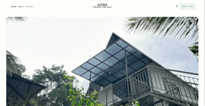

<h2 align="center">🏝️ Azura - The Water View Resort</h2>

<h4 align="center">
  A responsive resort landing page designed using HTML, CSS, JavaScript, and Bootstrap 5.
</h4>

  

---

## 📌 Project Overview

**Azura - The Water View Resort** is a modern, visually appealing **resort website landing page**, designed to promote a fictional luxury resort experience.  
The website includes multiple sections such as:

- Hero image carousel  
- Accommodation cards  
- Amenities icons  
- Booking form  
- Gallery section  
- Embedded map  
- Contact form  

It is **fully responsive** and built using **Bootstrap 5.3.7**, with added animations and layout optimizations.

---

## 🛠️ Technologies Used

- ✅ **HTML5** – Page structure  
- ✅ **CSS3** – Custom styling and layout  
- ✅ **JavaScript** – Form and interactive behaviors  
- ✅ **Bootstrap 5.3.7** – Grid system, components, responsiveness  
- ✅ **Google Maps Embed** – Location integration  
- ✅ **Font Awesome** – Icons for amenities  

---

## 💡 Key Features

- 🌐 **Responsive design** using Bootstrap Grid & Media Queries  
- 🖼️ **Image carousel** in the hero section  
- 🏨 **Accommodation section** with room cards  
- 🧘‍♀️ **Amenities list** with icons  
- 📝 **Booking form** with validation-ready structure  
- 🖼️ **Image gallery** with hover zoom  
- 📍 **Google Map embed** for location  
- 📬 **Contact form** with styled inputs

---

## 📂 Folder Structure

Resort/
├── index.html
├── /css
│ └── style.css
├── /js
│ └── script.js
├── /images
│ ├── hero.jpg
│ ├── room1.jpg
│ ├── gallery1.jpg
│ └── [other resort assets]
├── /videos
│ └── [optional video assets]
├── /icons
│ └── [SVG or icon images]
└── README.md
